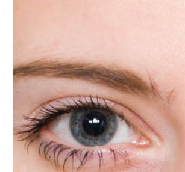

Darija startet kunstutdannelsen sin i Litauen, ved Vienozinskis Kunstskole (1994–98), tok BA på Vilnius Kunstakadademi (1999–03) med utveksling på Lahti University of Applied sciences, Finland i 2001 og avsluttet utdanningen med en master i industridesign på Arkitektur- og Designhøgskolen i Oslo i 2004. Hun har vært aktivt involvert i flere kunstprosjekter og utstillinger i Norge, Litauen og Tyskland.

## UTSTILLINGER:

* 2010 Gruppeutstilling, malerier. Galleri Pingvin, Oslo
* 2010 Separatutstilling, malerier & ymse. Galleri Jan Graff, Oslo
* 2010 Art:Oslo, messe. Oslo Spektrum
* 2010 Separatutstilling, "Menneskelig – ganske enkelt", malerier. Galleri Dalype, Oslo
* 2010 Utstilling med foto-video-prosjektet "Det finnes intet 'Jeg'" med Migrating Birds på Nordic Light International Festival of Photography i Kristiansund
* 2010 Separatutstilling, malerier. Den Litauiske Ambassaden, Oslo
* 2009 Gruppeutstilling, foto-video. Jono Meko Vizualiuju Menu Centras, Vilnius, Litauen
* 2008 Gruppeutstilling, foto-video. Kulturhuset i Birstonas, Litauen