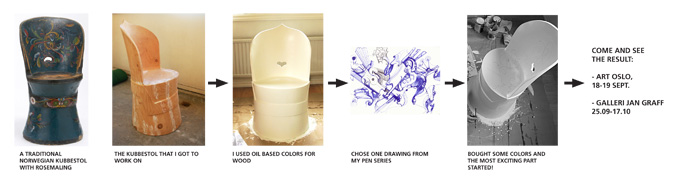

### Kubbestol (wooden chair) is an exciting experiment combining traditional Norwegian craftsmanship with modern decoration in Darija's style.

**COME AND SEE MY CRAZY KUBBESTOL:** My friend's grandfather was a handy man, and one of his doings was a traditional kubbestol, made of a whole pice of wood. We dug it out in my friend's uncle's storage room - dusty and unfinished. After some rounds with sand paper I covered it with white and now the exciting part starts. I want to decorate it. Paint it. Not with a traditional Norwegian rosemaling, but with my own pattern. So called Darija's kruseduller. I think it is an interesting combination of old and modern. Come to Art:Oslo to my stand, and see how this experiment will turn up!

### Exhibited

1) ART OSLO. STAND A02-19, Oslo Spektrum, Sonja Henies plass 2, Oslo. More: Art:Oslo >>
   18.–19. Sept. 2010. Open Saturday and Sunday 10:00–18:00. At the stand: Oil paintings, photos and the exotic kubbestol!

2) GALLERI JAN GRAFF, Radarveien 4, Karlsrud, Oslo. Map >>
   25.09-17.10, 2010. Opening hours: Sat. - Sun. 11.00–18.00, Wen. 17.00–19.00, or by agreement.

### How i started:

Can't stop! Now I started on another, normal though, chair we had at home. Since my BF very much wanted to keep its main purpose - be as a smth to stand on I decided to paint it underneath. Isn't it great? You can stand on it, use it rough as much as you want and it will keep its artistic value. Like those expensive cloths, you know, those you can see special marks only if you take them off... So.. bring along your old wooden furniture!

### Get your wooden furniture or walls painted in Darija's style!

 *In September I started working on kubbestolen. Excited to see how it will end up. One thing I can tell for sure: It is NOT going to be a traditional Norwegian kubbestol! Darija, Sept. 2010*