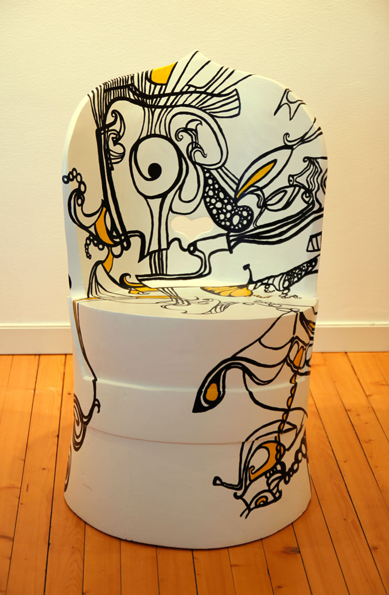
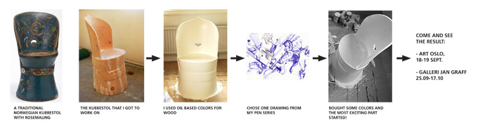
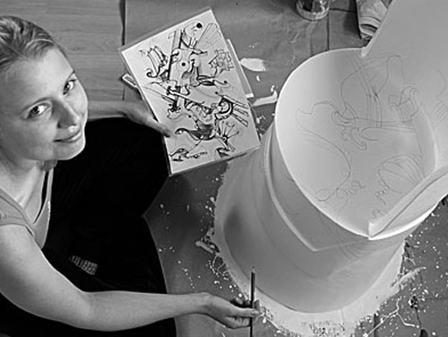

### Kubbestol er et spennende prosjekt som kombinerer tradisjonelt norsk håndverk med moderne dekorasjon i darijas stil.

**Om kubbestolen:** Farfaren til en venn var en hendig mann, og en av tingene han likte å lage, var kubbestoler, laget av hele tømmerstokker. Vi gravde den støvete stolen fram fra roterommet på låven, og etter noen runder med sandpapir, har jeg dekket den med hvitmaling. Og så begynner den spennende delen. Jeg har tenkt å dekorere den. Male den. Ikke med tradisjonell rosemaling, men med et av mine egne mønstre. De såkalte Darijas kruseduller. Jeg synes det er en interessant kombinasjon av gammelt og moderne. Kom til Art:Oslo til standen min og se hvordan eksperimentet ender opp!

### Skal bli utstilt:

1) ART OSLO. STAND A02-19, Oslo Spektrum, Sonja Henies plass 2, Oslo. Les mer om Art:Oslo >>
   18.–19. september 2010. Åpent lø–søn kl. 10–18. På standen: Oljemalerier, foto og den eksotiske kubbestolen!

2) GALLERI JAN GRAFF, Radarveien 4, Karlsrud, Oslo. Kart >>
   25.09-17.10 2010. Åpningstider: lø–sø 11–18, ons 17–19, eller etter avtale.

### Slik startet jeg:

### Få dine tremøbler og vegger malt i darijas stil!

 *Kubbestol Art:oslo I september startet jeg arbeidet med kubbestolen. Det blir spennende å se hvordan den ender opp. En ting kan jeg si for sikkert: Dette blir IKKE en tradisjonell norsk kubbestol! Darija, sept. 2010*