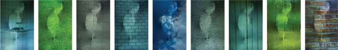
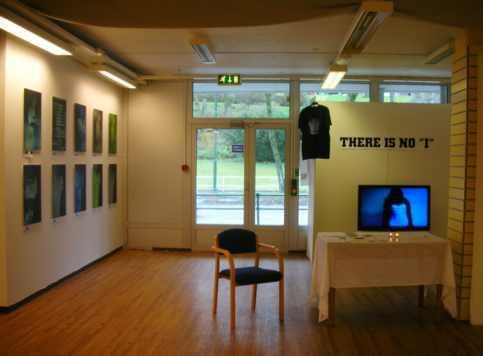

*The photo–video project“THERE IS NO ’I’” takes part in Nordic Light International Festival of Photography, Kristiansund i 2010.**

**Shifting experiential contexts allow for recognition that the so-called ”I” exists only so far as a given context.**

**ARTISTS:** Migrating birds 2008. Darija Sapozenkova-Hauge (NO), Paulius Budraitis (USA), Indre Klimaite (NL). Photo technician: Arnas Anskaitis (LT), sound technician: Lina Lapelyte (UK).

**ABOUT MIGRATING BIRDS:** The project “There is no ‘I’” was conducted during the Migrating Birds workshop in Lithuania, 2008. Lithuanian artists of different background living abroad or in Lithuania gathered in Birstonas for a common purpose – for a professional dialog and common work. Many talented artists emigrated from Lithuania to the West after Lithuania regained independence. Migrating Birds, supported by The Lithuanian Ministry of Foreign Affairs, is a project that tries to bring those talents back, if not physically but through their works. In 2009 Vilnius became the European Capital of Culture and housed many creative events and cultural live arrangements.

**“THERE IS NO ‘I’”** is a project about identity and inner processes within the individual. It is about how strongly individuals get affected by the environment. The so-called “I” melts in the constant change and intensive amount of contexts. “I” lives in a constant change of contexts and is affected accordingly. It is important to remember that this theme was chosen by people who experienced emigration, but still keep strong connection with their home land.

**IMPORTANT: No photo editing in the photographs. No video editing in the video.**

**PURCHASE:** The ten best images from the series will be for sale during the exhibition (print on plastic, 40 x 60 cm). The artist keeps the right to sell four more copies of the prints on request. If you want to get a price list, send an e-mail with PRICE LIST, THERE IS NO I in the subject line to darija(at) darijasart.com. During the exhibition you can also buy conceptual “There is no ‘I’” T-shirts and postcards. Thank you for your interest!

**LECTURE:** 29/04 2010. 10.30-13.00 at Caroline Kino, Kristiansund.

**EXHIBITION.** Folkets hus, Kristiansund.

*"It was a great honor to share an exhibition sight with you: Romano Cagnoni, Chris Rainier, Alison Jackson, Arturas Valiauga, Shehab Uddin, Philip Mccormack, Øystein Kvanneid, Alexandra Demenkova and Point of No Return".*

# PROJECT «THERE IS NO "I"» / VIDEO

**Enhet (NO) / Oneness (EN) / Vienis (LT)**
Lithuania, 2008. Video

# PROJECT «THERE IS NO "I"» / PHOTO

