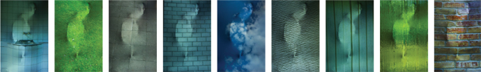
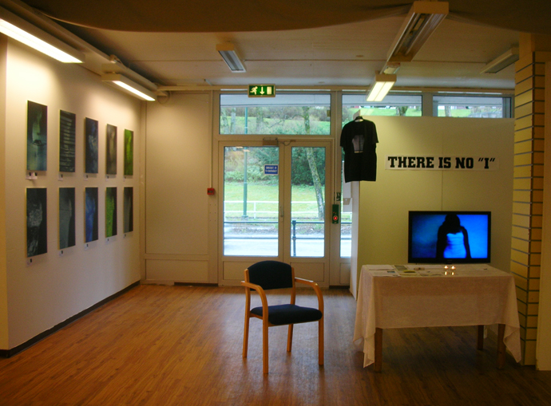
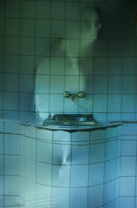
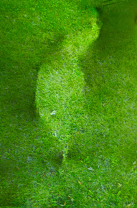
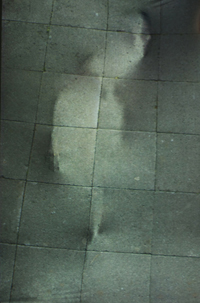
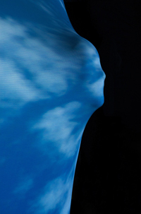
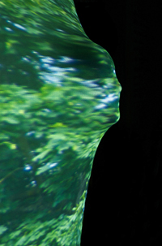
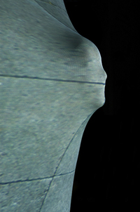

**Foto–video-prosjektet “THERE IS NO ’I’” ble utvalgt til Nordic Light International Festival of Photography, Kristiansund i 2010.**

**“Det finnes intet ’Jeg’” – endring av konteksten vi opplever i, åpner for anerkjennelsen av at det såkalte “Jeget” bare eksisterer innenfor en gitt kontekst.**

**KUNSTNERE:** Migrating Birds 2008. Darija Sapozenkova-Hauge (NO), Paulius Budraitis (USA), Indre Klimaite (NL). Fototekniker: Arnas Anskaitis (LT). Lydtekniker: Lina Lapelyte (UK).

**OM MIGRAITING BIRDS:** Prosjektet “There is no ’I’” ble til under Migrating Birds sin workshop i Litauen i 2008. Litauiske kunstnere med ulik bakgrunn, boende både i Litauen og utenlands, samlet seg i Birstonas med et felles mål – å gå inn i en profesjonell dialog og et profesjonelt samarbeid. Mange talentfulle kunstnere emigrerte fra Litauen til Vesten etter Litauens uavhengighet. Migrating Birds er et prosjekt som, med støtte fra Det Litauiske Utenriksdepartementet, prøver å få disse talentene til å vende tilbake, om ikke rent fysisk, så i alle fall gjennom arbeidene deres. I 2009 ble Vilnius europeisk kulturhovedstad og huset mange kreative og kulturelle arrangementer.

**“THERE IS NO ’I’” – “DET FINNES INTET ’JEG’”** – er et prosjekt som handler om identitet og indre prosesser i individet, om hvor sterkt individet blir påvirket av omgivelsene. Det såkalte “Jeget” smelter inn i den evige forandringen og intense mengden av kontekster. “Jeget” lever i en konstant endring av kontekst og blir påvirket deretter. Det er viktig å huske at dette temaet ble valgt av mennesker som har opplevd en emigrasjon, men som fremdeles holder en sterk kontakt med hjemlandet.

**VIKTIG: Ingen bilde / video redigering brukt.**

**SALG:** De ti beste bildene fra serien vil være til salgs under utstillingen (trykk på plastikk, 40 x 60 cm). Kunstneren forbeholder seg retten til å selge ytterligere fire kopier av trykkene. Dersom du ønsker prisliste, send en e-post med PRISLISTE, THERE IS NO I, i tittelfeltet til darija(at)darijasart.com. Under utstillingen kan du også kjøpe konseptuelle “There is no ‘I’” T‑skjorter og postkort. Takk for interessen!

**FOREDRAG:** 29.april 2010. 10.30-13.00, Caroline Kino, Kristiansund.

**UTSTILLING.** Folkets hus i Kristiansund.

*"It was a great honor to share an exhibition sight with you: Romano Cagnoni, Chris Rainier, Alison Jackson, Arturas Valiauga, Shehab Uddin, Philip Mccormack, Øystein Kvanneid, Alexandra Demenkova and Point of No Return".*

# Prosjekt «There is no "I"» / video

**Enhet (NO) / Oneness (EN) / Vienis (LT)**
Litauen, 2008. Video

# Prosjekt «There is no "I"» / foto

