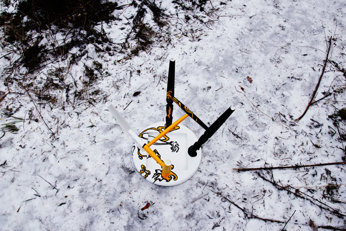

## CHAIR 2011

A simple IKEA stool transformed into a romantic coffee table.

## STOOL 2010

Many so-called design chairs have less function than looks. Stool project is an attempt to remind how functional old forms are. You can stand on this stool while painting your ceiling with no fear of destroying its pricey designs. Because most of the decoration is underneath! It is like clothing that has prints only inside, so that only you and your lover can see the hidden treasure you possess...

**A handy stool for a working man!**

## BOX 2011

Interior-friendly toolbox.

